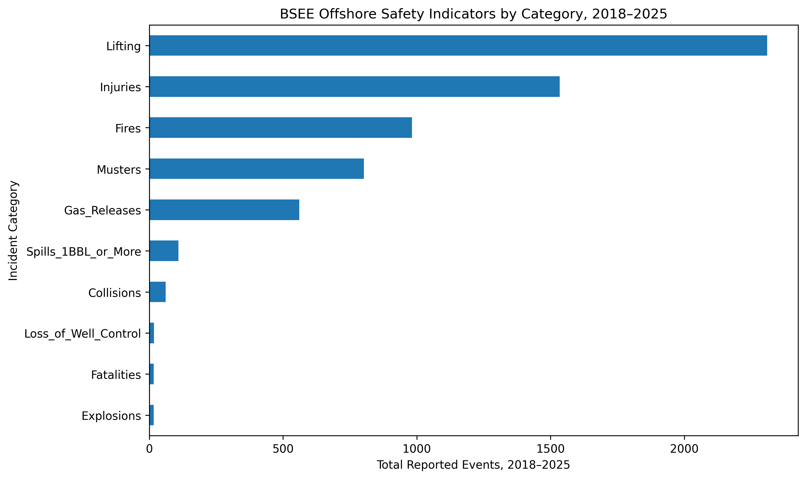
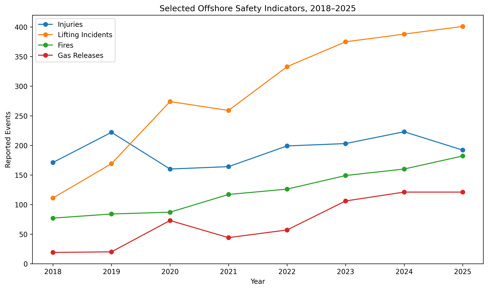
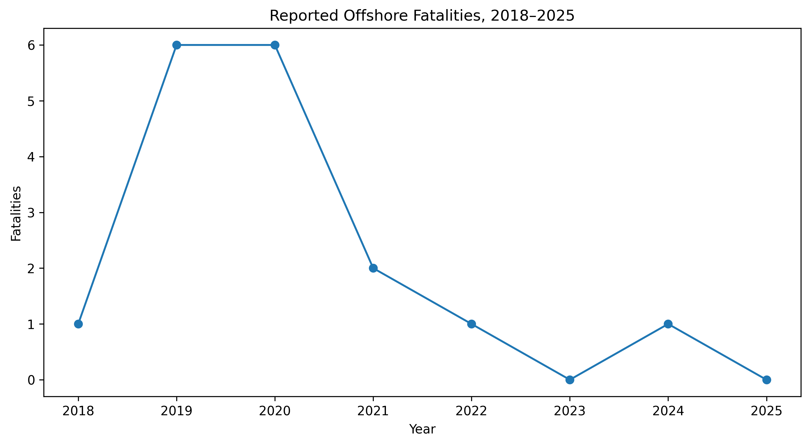
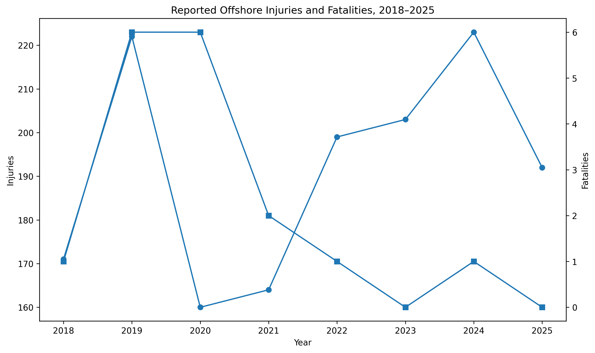
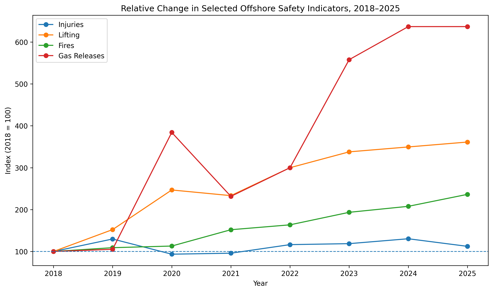

# Offshore HSE Incident Analysis

A reproducible exploratory analysis of offshore safety indicators reported by the U.S. Bureau of Safety and Environmental Enforcement (BSEE) from 2018 to 2025.

The project focuses on incident frequency, long-term changes, high-consequence outcomes, and safety indicators that may warrant closer monitoring.

## Objective

This analysis examines three main questions:

1. Which offshore safety indicators were reported most frequently between 2018 and 2025?
2. Which indicators showed the largest relative increase over the period?
3. Why should incident frequency and consequence severity be considered separately in HSE monitoring?

## Data Source

The data were obtained from the Bureau of Safety and Environmental Enforcement (BSEE) Offshore Incident Statistics.

The analysis uses calendar-year data from 2018 to 2025.

The indicators examined include:

- Fatalities
- Injuries
- Lifting incidents
- Fires
- Explosions
- Musters
- Gas releases
- Collisions
- Loss of well control
- Spills of one barrel or more

## Important Data Note

BSEE reporting categories are not necessarily mutually exclusive.

A single offshore event may contribute to more than one indicator. For example, an event involving a fire and an injury may appear in both categories.

The values in this project should therefore not be summed and interpreted as the total number of unique offshore accidents.

## Key Findings

### 1. Lifting incidents were the most frequently reported indicator

Across 2018–2025, the cumulative reported values were:

| Indicator | Total |
| --- | ---: |
| Lifting incidents | 2,310 |
| Injuries | 1,534 |
| Fires | 982 |
| Musters | 802 |
| Gas releases | 561 |
| Spills ≥1 barrel | 109 |
| Collisions | 61 |
| Loss of well control | 18 |
| Fatalities | 17 |
| Explosions | 17 |

Lifting incidents represented the highest-frequency indicator within the selected dataset.

## 2. Gas releases showed the largest relative increase

Between 2018 and 2025:

| Indicator | 2018 | 2025 | Change |
| --- | ---: | ---: | ---: |
| Injuries | 171 | 192 | +12.3% |
| Lifting incidents | 111 | 401 | +261.3% |
| Fires | 77 | 182 | +136.4% |
| Gas releases | 19 | 121 | +536.8% |

Reported gas releases showed the largest relative increase, rising from 19 in 2018 to 121 in 2025.

Lifting incidents also increased substantially, rising from 111 to 401 over the same period.

These values describe changes in reported indicators and should not automatically be interpreted as equivalent changes in underlying offshore risk.

## 3. Repeated reporting trends should be interpreted carefully

An increase in reported events may reflect several factors, including:

- Changes in operational activity
- Increased exposure hours
- Reporting practices
- Regulatory requirements
- Detection and monitoring capability
- Safety culture
- Changes in offshore workforce or asset activity

Without an exposure denominator, such as work hours or number of offshore operations, this analysis cannot calculate true incident rates.

## 4. Frequency and consequence are different HSE dimensions

Fatalities occurred much less frequently than lifting incidents, injuries, fires, or gas releases.

However, low-frequency events may still carry substantially greater consequence severity.

This highlights an important HSE principle:

> High-frequency events and high-consequence events should not be treated as equivalent safety risks.

Frequency alone is not sufficient for safety prioritization.

## Indexed Trend Analysis

To compare indicators with very different raw values, 2018 was converted to an index value of 100.

This allows relative changes to be compared on the same scale.

By 2025:

- Injuries reached approximately 112 on the index
- Fires reached approximately 236
- Lifting incidents reached approximately 361
- Gas releases reached approximately 637

The indexed analysis highlights the particularly large relative increase in reported gas releases.

## Safety Monitoring Priority

A descriptive monitoring classification was created using percentage change between 2018 and 2025.

This classification is not an official BSEE risk rating and should not be interpreted as a formal HIRARC or quantitative risk assessment.

Its purpose is only to highlight indicators showing substantial changes over time.

The strongest monitoring signals were observed for:

- Gas releases
- Lifting incidents
- Fires

## Visualizations

### Offshore Incident Category Totals

### Selected Offshore Safety Trends

### Offshore Fatalities

### Injuries vs Fatalities

### Indexed Safety Trends

## Reproducing the Analysis

The complete workflow is contained in:

`offshore_hse_incident_analysis.ipynb`

To reproduce the analysis:

1. Open the notebook in Google Colab or Jupyter Notebook.
2. Load the BSEE annual incident statistics.
3. Create the Pandas DataFrame.
4. Run the descriptive statistics.
5. Calculate changes between 2018 and 2025.
6. Generate indexed trend values using 2018 as the baseline.
7. Generate the visualizations and output tables.

## Files

`offshore_hse_incident_analysis.ipynb`  
Contains the complete analysis workflow.

`offshore_category_totals.csv`  
Contains cumulative values for each safety indicator.

`offshore_trend_summary.csv`  
Contains 2018 and 2025 values and percentage changes.

`offshore_risk_profile.csv`  
Summarizes selected high-frequency and high-consequence indicators.

`offshore_indexed_trends.csv`  
Contains relative trend values using 2018 = 100.

`offshore_annual_average.csv`  
Contains mean annual values for each safety indicator.

`offshore_monitoring_priority.csv`  
Contains the descriptive monitoring-priority classification.

## Tools

- Python
- Pandas
- NumPy
- Matplotlib
- Google Colab

## Limitations

This project is a descriptive analysis and not a formal offshore risk assessment.

Important limitations include:

- Reporting categories may overlap.
- Counts do not account for exposure hours.
- Changes in reporting practices may affect trends.
- The analysis does not establish causation.
- BSEE data represent the offshore activities covered by its regulatory jurisdiction and should not be generalized directly to the global offshore industry.
- Percentage changes can appear large when baseline values are small.

The findings should therefore be interpreted as reported safety trends rather than direct measures of underlying risk.

## Author

PenguinLogic
